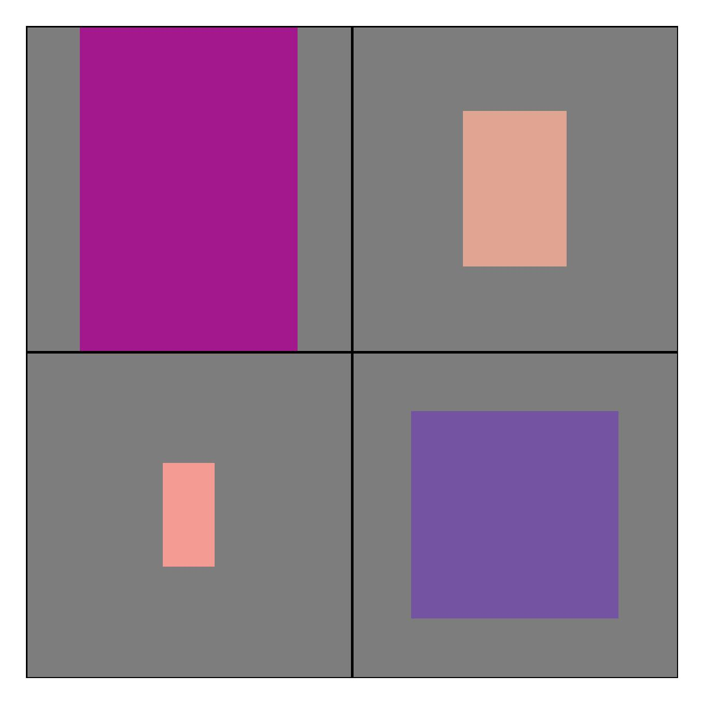
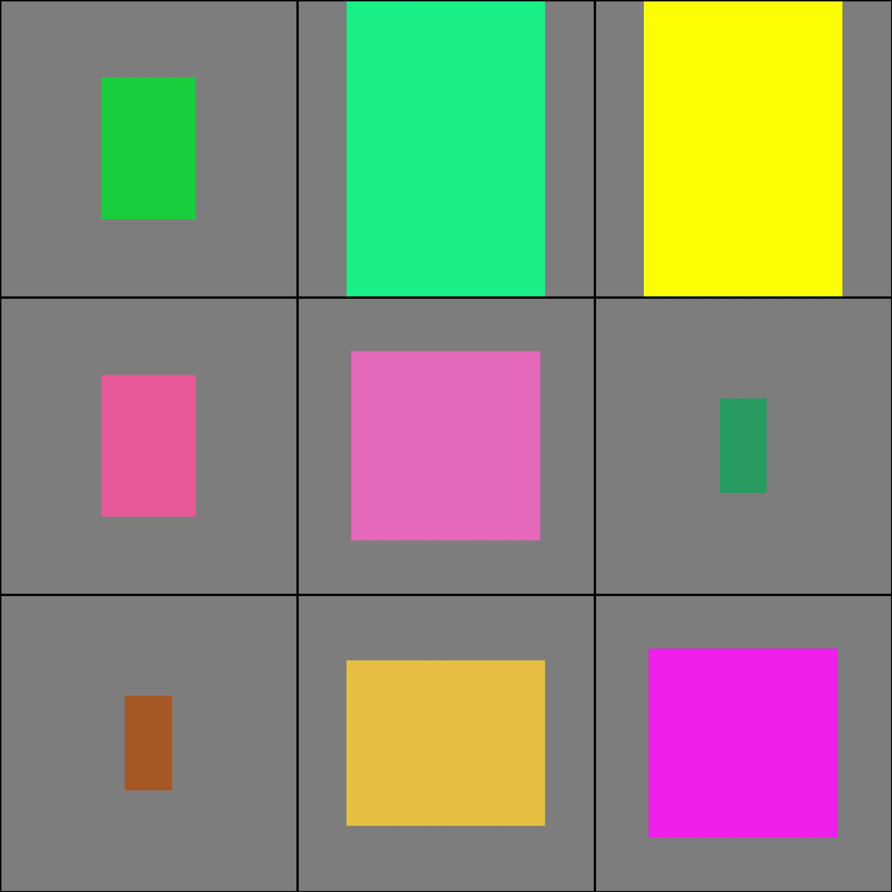

# Image Gridder

Yes, it's a terrible name. Image gridder it quite a specific tool for organising
a group of images in a directory into a grid so they can sit together in one
complete image.

## Why?

I wanted a system where I could pass any number and size of images to it and
it would return one combined image. I kept making this over and over for
specific projects so it made sense to wrap it up into it's own repo,
so rather than constantly copy and tweak code this can be used.

## How does it work?

Instantiation can be seen in the `example_runs` file, but in essence the system
works like this:

1. First, create a folder of images
1. Instantiate `ImageGrid()` passing the directory and any other configurable
   args (see image_grid.ImageGrid for args)
1. All the images in the directory are resized to a new image with the dimensions
   of the largest image size in the original directory.
1. Given the amount of images, a grid size is worked out
1. The resized images are then placed left to right on the grid.
1. A new single image is then created and saved.

### Examples

_See `./example_runs.py` for example code for the below images_

An image grid made up from 4 equal sized images

An image grid made up of 4 different sized images

An image grid made up of 9 images

An image grid made up of 100 equal images

TODOS

- [ ] Fill mode (images zoomed in to fill area)
- [ ] Testing images with numpy
- [ ] Canvas margins
